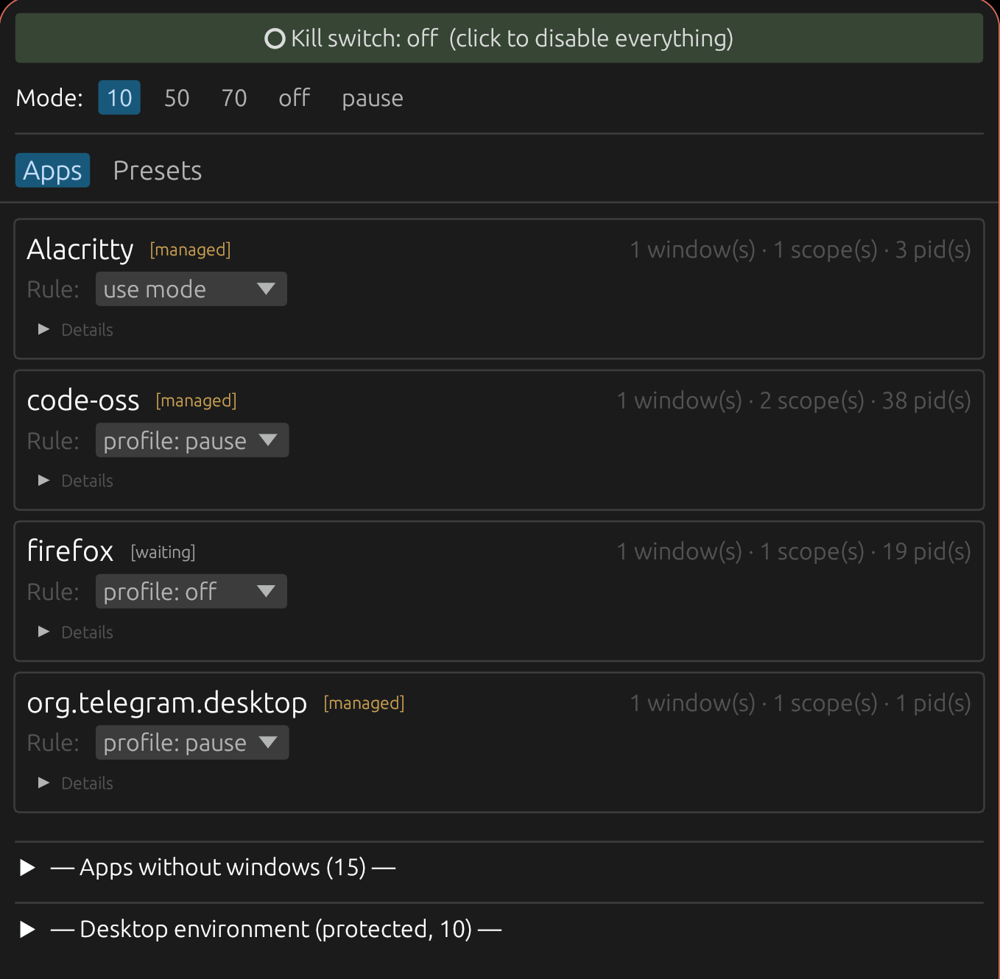
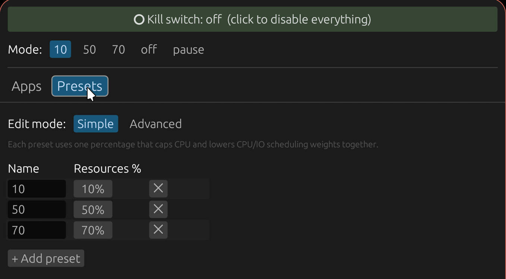

# niri-battery-keeper

> ⚠️ **Work in progress — not production-ready.** This is an early personal
> project. Behaviour may be unstable, modes can leave background apps in
> unexpected states (frozen language servers, stuck IPC, etc.), and breaking
> config changes are likely between versions. Bug reports welcome, but don't
> trust your daily-driver workflow to it yet.

Focus-driven CPU/IO governor for unfocused apps on the [Niri](https://github.com/YaLTeR/niri)
Wayland compositor. Throttle or freeze background apps when you're not using
them; let them run free when you focus them back.

Built to extend battery life on Niri laptops where idle Electron apps,
language servers and background tabs would otherwise quietly drain your
charge.

One static binary (≈ 5 MB stripped). Rust + egui + `systemctl --user`.
Works on any modern Linux with systemd ≥ 246 and cgroup v2.

| Apps view | Presets view |
|-----------|--------------|
|  |  |

## What it does

- Listens to `niri msg --json event-stream` for window focus events.
- For each app, walks its process tree and discovers **every systemd scope**
  the app's processes live in — including detached helpers like language
  servers (so freezing VSCode actually freezes its `node`-based helpers too).
- Applies cgroup-v2 limits (`CPUQuota` / `CPUWeight` / `IOWeight`) or the
  cgroup freezer to all scopes of an app when it's unfocused. Reverses
  everything when you refocus.
- Two-level protection: the compositor itself (niri), the shell
  (DankMaterialShell / quickshell), portals, audio daemons, etc. are never
  managed, even when an app accidentally lives in their cgroup
  (e.g. Firefox opened via xdg-open from a notification).
- A small GUI lets you switch the global mode, exclude apps, and pin per-app
  rules. A CLI subcommand mirrors the same for keybinds.
- An optional **TDP tab** writes Intel RAPL PL1/PL2 power limits — keep the
  CPU at a sustained 5–15 W to quiet down the fan when you don't need full
  turbo. Installs its root helper through a single pkexec prompt; no
  separate config file.
- On shutdown, every scope it touched is reset to system defaults.

## Status

Early. Pre-1.0, in active development, **expected to break in fun ways**.
Works for the author on Niri 26.04 / Arch-family. Reports and patches
welcome.

## Requirements

- Linux with **systemd ≥ 246** (for `freeze`/`thaw` and `CPUQuota=` syntax)
- **cgroup v2** as the unified hierarchy (default on Arch, Fedora 32+, Ubuntu 21.10+, Debian 12+, etc.)
- **Niri** with `niri msg --json event-stream` (verified on 26.04)
- Wayland session
- For the optional TDP tab: an **Intel CPU** with `intel-rapl` in
  `/sys/class/powercap/`, plus a polkit authentication agent running in the
  session (e.g. `hyprpolkitagent`, `polkit-gnome`, `lxqt-policykit`)

## Install

Grab the latest x86_64 build, mark it executable, run it. The first
launch shows an "Install service" banner — one click writes the systemd
user unit and starts the background daemon. No Rust toolchain needed.

```sh
curl -L -o niri-battery-keeper \
  https://github.com/petrovichest/niri-battery-keeper/releases/latest/download/niri-battery-keeper-x86_64-linux
chmod +x ./niri-battery-keeper
./niri-battery-keeper
```

The "Install service" button copies the binary into `~/.local/bin/`,
writes `~/.config/systemd/user/niri-battery-keeper.service`, and runs
`daemon-reload` + `enable --now`. Idempotent — clicking it again upgrades
in place.

To remove the background service later, use the **Uninstall** button in
the GUI. It stops and disables the unit and deletes the unit file. The
binary in `~/.local/bin/` and your config in `~/.config/niri-battery-keeper/`
stay put — wipe them by hand if you also want those gone.

Default config is written to `~/.config/niri-battery-keeper/config.toml` on
first run. Mode defaults to **`off`** — the daemon does nothing until you
pick a mode in the GUI.

### Build from source

Needs `rustc` 1.80+.

```sh
git clone https://github.com/petrovichest/niri-battery-keeper.git
cd niri-battery-keeper
cargo build --release
./target/release/niri-battery-keeper          # launches GUI, click Install service
```

### Manual install (no GUI)

If you'd rather wire things up yourself, e.g. from a packaging script:

```sh
install -Dm755 target/release/niri-battery-keeper ~/.local/bin/niri-battery-keeper
install -Dm644 systemd/niri-battery-keeper.service \
               ~/.config/systemd/user/niri-battery-keeper.service
systemctl --user daemon-reload
systemctl --user enable --now niri-battery-keeper.service
```

## Usage

Launch the GUI to do anything user-facing — pick a mode, toggle the kill
switch, edit presets, set per-app overrides, install or uninstall the
service. The binary itself only takes two invocations:

```sh
niri-battery-keeper          # open the GUI
niri-battery-keeper daemon   # what the systemd unit runs (don't invoke directly)
```

Bind the GUI to a Niri keybind if you want one-key access
(`~/.config/niri/config.kdl`):

```
Mod+Shift+B { spawn "niri-battery-keeper"; }
```

## Kill switch (panic button)

The **Kill switch** toggle at the top of the GUI is a global override that
beats every other setting. When engaged it overrides `active_mode` AND
every per-app `profile` / `use_mode` rule, unfreezes/clears every scope
the daemon had touched, and stops applying new restrictions until you
flip it back. The daemon keeps running and tracking focus events, so
re-enabling is instant. State persists in `config.toml` across daemon
restarts.

Use this when you're experimenting with profiles and want a single
reliable knob that guarantees the program has zero effect on your system.
If the daemon itself is hung and unresponsive to IPC,
`systemctl --user stop niri-battery-keeper.service` runs the same cleanup
via SIGTERM.

## Default modes

| Mode      | Action              | CPU Quota | CPU Weight | IO Weight |
|-----------|---------------------|-----------|------------|-----------|
| off       | no restriction      | —         | —          | —         |
| minimal   | throttle            | 5%        | 5          | 5         |
| pause     | freeze cgroup       | —         | —          | —         |

`CPUQuota=5%` means 5% of a single core (50 ms/sec). `CPUWeight` and
`IOWeight` are systemd's relative scheduling weights (default 100). `pause`
uses the cgroup-v2 freezer — the process keeps its memory but consumes 0 %
CPU until you refocus it.

You can add custom presets, edit values, or change the action type in the
GUI's **Presets** tab.

## Per-app rules

Override the global mode for individual apps in `[apps.<id>]`. The `<id>`
is the `app_id` reported by Niri (`niri msg --json windows | jq '.[].app_id'`).

```toml
[apps."org.telegram.desktop"]
override = "exclude"               # never touch Telegram

[apps.firefox]
override = "profile"
profile  = "minimal"               # always Minimal for Firefox

[apps."code-oss"]
override = "use_mode"              # follow active_mode (default)
```

You can also edit these from the GUI's per-app card.

## TDP control

The **TDP** tab in the GUI exposes Intel RAPL power limits — two sliders
(PL1 sustained, PL2 burst), live CPU temperature, live wattage, and an
Apply button. Lower PL1 ⇒ lower sustained heat ⇒ quieter fan; raise PL2 if
you still want short bursts to feel snappy.

Quick mental model:

- **PL1** caps a moving average over ~28 s. Sustained workloads (compile,
  encode) settle to this number.
- **PL2** caps short (~2.4 ms) bursts. Short tasks (open a tab, run a
  command) can spike up to this.
- Setting PL1 = 0 disables the long-term constraint; PL2 then acts as the
  only cap until thermal throttling kicks in.

OEM defaults on most laptops put PL1 = PL2 = nameplate TDP (e.g. 28 W or
40 W); the fan ramps accordingly. Dropping to PL1 = 15 W is usually
inaudible for browsing/coding workloads on recent Intel chips.

### One-time setup

The first visit to the TDP tab shows a blue **Set up TDP control** card
with one button. Click it; a polkit dialog appears once. With your
password it installs:

- a root-owned copy of the main binary at `/usr/local/bin/nbk-set-rapl`
  (multi-call dispatch — same binary, different name)
- a polkit policy at `/usr/share/polkit-1/actions/...set-rapl.policy`
  granting pkexec access to that helper with `auth_admin_keep` (5-min
  password cache)
- a udev rule at `/etc/udev/rules.d/60-intel-rapl-energy.rules` opening
  `energy_uj` to the `wheel` group so the live wattage readout works
  without root

If no polkit authentication agent is running in your Niri session, the
TDP tab shows a yellow banner with the install command for
`hyprpolkitagent`. Without an agent neither install nor Apply can show a
password prompt.

Limits reset to OEM on reboot — re-apply your preferred values after each
boot, or wire up your own systemd unit if you want them persistent.

### Caveats

- Intel-only. AMD CPUs use a different power-management interface that
  this tab does not touch yet.
- After a `cargo install` or release upgrade, the `/usr/local/bin/nbk-set-rapl`
  copy is the old version. Delete it manually and revisit the TDP tab to
  reinstall — there's no in-GUI "reinstall helper" button yet.

## How it stays out of trouble

- **Two-level protection.** A scope is skipped if either (a) the PID our
  resolver sees is a protected process, or (b) the scope itself contains any
  protected process. Protected processes: niri, quickshell/qs,
  xdg-desktop-portal\*, dbus-daemon, pipewire, wireplumber, pulseaudio,
  swaync/mako/dunst, waybar/eww, fuzzel/wofi/rofi, polkit agents, display
  managers, systemd.
- **`--runtime` set-property.** Limits live in the cgroup only, never in
  persistent unit drop-ins. A reboot wipes them.
- **`Slice=session.slice`** in the systemd unit: keeps the daemon out of
  `app.slice` so it can't accidentally throttle itself.
- **Stale-sweep on startup.** Every scope the daemon discovers is thawed and
  has properties cleared before reconciliation — so a previous crash can't
  leave you with a frozen Firefox.
- **On SIGTERM/SIGINT/SIGKILL**, the daemon clears every property and thaws
  every scope it set. (SIGKILL skips the cleanup, hence the stale-sweep.)
- **SIGHUP** reloads the config file.

## Shared scopes (Firefox-in-Telegram and friends)

When you click a link in Telegram, it spawns Firefox via `xdg-open`, and
systemd puts the new Firefox process **inside Telegram's scope**. They now
share a cgroup. A daemon trying to throttle Firefox would inevitably
throttle Telegram too.

niri-battery-keeper detects this and refuses to manage shared scopes
whenever any app in them is focused. The trade-off: a Firefox launched from
Telegram is also unmanaged when both are unfocused — the only way to fix
that is to launch Firefox separately first (so future xdg-open requests
route to its own scope via DBus).

## Limitations

- Only manages apps that systemd places in their own `app-*.scope` /
  `run-*.scope` under `app.slice`. Apps launched from a terminal share the
  terminal's scope and are skipped.
- A few apps don't reliably expose their child processes via
  `/proc/<pid>/task/<tid>/children` (children that detach and reparent to
  PID 1). Those helpers will keep running even in `pause` mode. Patches
  welcome.
- Wayland/Niri only. The throttle/freeze code is compositor-agnostic, but
  the focus source is Niri-specific.
- Two windows of the same app instance (e.g. two Firefox windows of the
  same process) cannot be controlled independently — cgroups limit
  processes, not individual windows. Use separate profiles
  (`firefox -P work --no-remote`, etc.) for that.

## Files

- `~/.config/niri-battery-keeper/config.toml` — your config
- `$XDG_RUNTIME_DIR/niri-battery-keeper.sock` — IPC socket
  (line-delimited JSON; the GUI and CLI talk to the daemon through it)
- `~/.config/systemd/user/niri-battery-keeper.service` — systemd user unit

Installed by the TDP tab (only when you set up TDP control):

- `/usr/local/bin/nbk-set-rapl` — root-owned helper (a copy of the main
  binary; multi-call by argv[0])
- `/usr/share/polkit-1/actions/org.niri-battery-keeper.set-rapl.policy`
- `/etc/udev/rules.d/60-intel-rapl-energy.rules`

## License

MIT.
